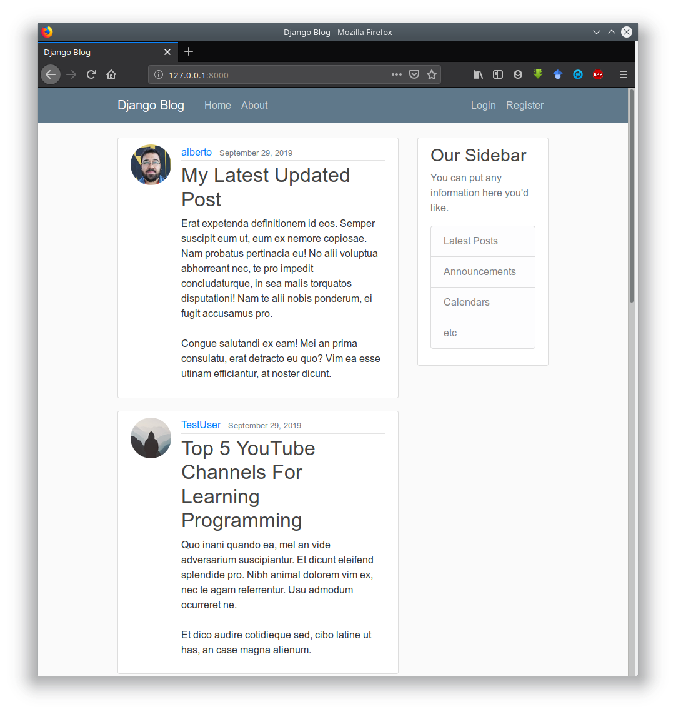

# django_web_app

## Screenshots

| Column A                        | Column B                     |
|---------------------------------|------------------------------|
|      |  |
|  |   |

## About

Building a web app with Django based on the tutorial series by  Corey Schafer that can be found at the link below.

- <https://www.youtube.com/playlist?list=PL-osiE80TeTtoQCKZ03TU5fNfx2UY6U4p>
