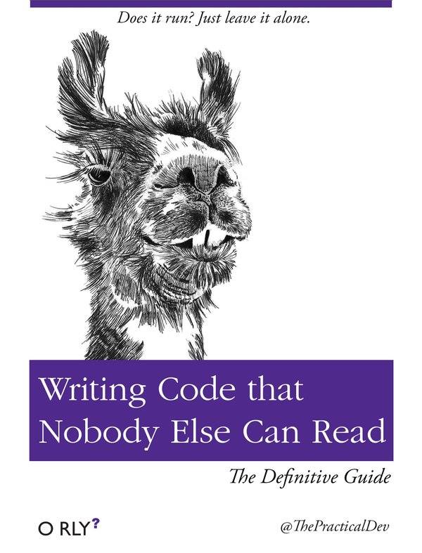

# PEP 8

## Introdução

Já dizia o Gurú/Criador do Python, Guido Van Rossum:

  > _O código é lido muito mais frequentemente do que é escrito._

Esse guia de estilo é sobre consistência. Tenha ciência que além de você outros
desenvolvedores terão que ler e entender o código. Sendo assim, intuito desse
guia é melhorar a legibilidade do código e torná-lo consistente em todo o
espectro do código Python. Como está escrito no próprio texto da
[PEP-8](https://www.python.org/dev/peps/pep-0008/): Lembre-se, Legibilidade
conta ([PEP-20](https://www.python.org/dev/peps/pep-0020)).



_Lembre-se outras pessoas terão que ler o código que você escreve._

Muitos projetos ou empresas tem seus próprios guias de estilo. A exemplo disso
podemos citar o [Google](https://google.github.io) com seu site sobre o assunto
no [GitHub](https://google.github.io/styleguide/pyguide.html).

## Layout de Código

### Identação

A recomendação é sejam usados 4 espaço por nível de identação. Por exemplo:

```python
if True:
    print("It works")


for element in range(0, 5):
    print(element)
```

Continuação de linha deve ser alinhada verticalmente dentro dos parênteses,
colchetes ou chaves ou usando
[_hanging ident_](https://www.computerhope.com/jargon/h/hanginde.htm).

#### 👍

```python
# Alinhado com o delimitador de abertura
foo = funcao_com_nome_grande(var_um, var_dois,
                             var_tres, var_quatro)


# Outro exemplo. Não confunde a lista de
# parâmetros com o bloco de código
def funcao_com_nome_grande(
        var_um, var_dois, var_tres,
        var_quatro):
    print(var_um)


# Hanging idents deve adicionar um nível
foo = funcao_com_nome_grande(
    var_um, var_dois,
    var_tres, var_quatro)
```

#### 👎

```python
# Sem alinhamento vertical da lista de argumentos
foo = funcao_com_nome_grande(var_um, var_dois,
    var_treis, var_quatro)


# Identacao indistinguível do bloco de código
def funcao_com_nome_grande(
    var_um, var_dois, var_tres,
    var_quatro):
    print(var_um)
```

Quando a parte condicional de um ```if``` é muito extensa, obrigando a
escrevê⁻lá em múltiplas linhas, o uso em conjunto com parêntesis cria
naturalmente uma identação de 4 espaços que pode dificultar a distinção com
bloco de código.

#### 👎

```python
# A condição do "if" está verticalmente alinhada ao bloco.
if (isso_e_uma_coisa and
    aquilo_e_outra_coisa):
    faz_algo()
```

#### 👍

```python
# Adicione um comentário
if (isso_e_uma_coisa and
    aquilo_e_outra_coisa):
    # Se as duas condições forem verdadeiras, podemos fazer algo.
    faz_algo()


# Ou simplesmente adicione um nível de identação
if (isso_e_uma_coisa and
        aquilo_e_outra_coisa and
        mais_alguma_coisa):
    faz_algo()
```

Fechamento de chaves, colchetes e parêntesis em declarações de várias linhas,
podem ser alinhadas em relação ao primeiro caractere de não espaço em branco da
última linha da lista.

```python
minha_lista = [
    1, 2, 3,
    4, 5, 6,
    ]


meu_dicionario = {
    'a': 'A',
    'b': 'B',
    }


resultado = alguma_funcao_com_argumentos(
    'a', 'b', 'c',
    'd', 'e', 'f',
    )
```

ou talvez possa ser alinhado ao primeiro caractere da linha que inicia a
declaração multi linha.

```python
minha_lista = [
    1, 2, 3,
    4, 5, 6,
]


meu_dicionario = {
    'a': 'A',
    'b': 'B',
}


resultado = alguma_funcao_com_argumentos(
    'a', 'b', 'c',
    'd', 'e', 'f',
)
```

### Tabulação ou Espaços?

- Quatro espaços para cada nível de identação.
- Espaço (4 espaços) é vida!
- Tabulação? Não!

**Nota do editor: Mas se por um a tecla de espaço do seu teclado quebrar e você
ver obrigado a usar tabulação, quando comprar um novo o teclado, continue usando
só a tabulação. Não misture os dois no mesmo projeto, isso é meio que uma falta
de edução. Misturar tabulação e espaços no mesmo arquivo indica que você não é
uma pessoa do bem. 😒**

### Tamanho máximo das linhas

Geralmente é bom manter o tamanho máximo das linhas em 79 caracteres. Fazer isso
pode trazer vantagens como:

- Abrir arquivos lado a lado para fins de comparação;
- Você pode ver uma expressão inteira sem fazer um _scroll_ na horizontal, o que
- adiciona uma melhor legibilidade e compreensão do código.

_A melhor maneira de acondicionar linhas longas é a continuação implícita entre
parênteses, colchetes e chaves. Se for necessário, você pode colocar parênteses
em volta da expressão, mas há casos onde a barra invertida (\) é melhor._
-- VivaOLinux

```python
# Quebra de linha  usando o "\" para manter a linha no
# tamanho máximo de 79 caracteres.
with open('/path/to/some/file/you/want/to/read') as file_1, \
     open('/path/to/some/file/being/written', 'w') as file_2:
    file_2.write(file_1.read())
```

Comentários devem tem 72 caracteres de comprimento

### A linhda deve ser quebrada antes ou depois de um operador binário

Para evitar que operadores se espalhem por colunas diferentes na tela e que se
afastem de seus operandos da linha anterior, evite fazer quebras de linhas após
o operador binário.

#### 👎

```python
# Operadores ficam "perdidos" no código e desalinhados
renda = (salario_bruto +
         taxa +
         (dividendos - dividendo_quilificado) -
         imposto_de_renda -
         desconto_por_dependente)
```

#### 👍

```python
# Os operadores ficam alinhados e ficam ao lado de seus operandos
renda = (salario_bruto
         + taxa
         + (dividendos - dividendo_quilificado)
         - imposto_de_renda
         - desconto_por_dependente)
```

### Linhas em branco

- Separe funções de nível superior e definições de classe, com duas linhas em
  branco;
- Definições de método dentro de uma classe são separadas por uma linha em
  branco;
- Linhas em branco extras podem ser utilizados (com moderação) para separar
  grupos
  de funções. As linhas em branco podem ser omitidas entre um grupo de
  one-liners relacionado (por exemplo, um conjunto de implementações dummy);
- Use linhas em branco em funções, com moderação, para indicar seções lógicas;
- Python aceita o Ctrl-L (isto é, \^L)
  [_form feed_](https://www.computerhope.com/jargon/f/formfeed.htm) espaço em
  branco e muitas ferramentas tratam esses caracteres como separadores de
  página, assim você pode usá-los para separar páginas das seções relacionadas
  com o arquivo. Alguns editores e visualizadores web podem não reconhecer
  Ctrl-L como um _form feed_ e pode mostrar um outro _glyph_ no lugar.

### Codificação de arquivo fonte

Python 2 por padrão usa ASCII. Já o Python 3 usa UTF-8.

Arquivos usando ASCII, para Python 2 ou UTF-8, para Python 3, não devem ter um
_encoding cookie_.

Toda a biblioteca padrão usa sempre ASCII
([PEP 3131](http://www.python.org/dev/peps/pep-3131)) e palavras em inglês
sempre que possível. Além disso, strings e comentários devem ser em ASCII.
As únicas exceções são:

- Casos de teste testando os recursos não-ASCII;
- Os nomes dos autores. Autores cujos nomes não estão baseadas na alfabeto
  latino deve fornecer uma transliteração latina de seus nomes.

Projetos de código aberto com uma audiência global são incentivados a adotar uma
política similar.

**Nota do editor: Durante essa [_thread_](https://groups.google.com/d/msg/django-brasil/tT4Xa_h1qsA/LmuAPpwLSI0J)
no forum Python Brasil, no Google Groups, [Luciano Ramalho](https://br.linkedin.com/in/lucianoramalho)
(uma espécie de Gurú Python no Brasil e autor do Livro [_Fluent Python_](http://shop.oreilly.com/product/0636920032519.do))
dá uma ótima explicação sobre codificação de arquivos. Lá ele diz: _A rigor vc
pode escolher outro encoding, como `# coding: windows-1252`, se for muito fã do
Bill Gates, mas usar qualquer coisa que não seja utf-8 é meio falta de educação,
hoje em dia._ Sendo assim, seguindo essa recomendação devemos sempre utilizar
UTF-8 nos nossos códigos fonte. Então, no Python 3 não é necessário adicionar um
_encoding cookie_, porém no Python 2 deve-se usar `# coding: utf-8`. Fechô!? 😉**

### _Imports_

- Deve estar em linhas separadas:

#### 👍

  ```python
  import os
  import sys
  ```

#### 👎

  ```python
  import sys, os
  ```

- Mas tudo bem em fazer 😌:

  ```python
  from subprocess import Popen, PIPE
  ```

- Importações devem sempre vir no topo do arquivo, depois dos comentários de
  módulo e _docstrings_ e antes de variáveis globais e constantes.

  Devem estar agrupados na seguinte ordem:

  1. _imports_ da biblioteca padrão
  2. _imports_ de biblioteca de terceiros
  3. _imports_ locais ou da aplicação

- Importações absolutas são recomendadas, dessa forma são mais legíveis e tendem
  a se comportar melhor (ou pelo menos mensagens de erros melhores) se o systema
  de importação está configurado incorretamente (como quando um diretório dentro
  de um pacote acaba em sys.path)

  ```python
  import mypkg.sibling
  from mypkg import sibling
  from mypkg.sibling import example
  ```

  No entanto, as importações relativas explícitas são uma alternativa aceitável
  às importações absolutas, especialmente quando se trata de layouts de pacotes
  complexos, onde o uso de importações absolutas seria desnecessariamente
  verboso:

  ```python
  from . import sibling
  from .sibling import example
  ```

  Os códigos da biblioteca padrão do Python evitam o uso de layout complexo de
  pacotes e usa sempre importação absoluta. Importação relativa implícitas nunca
  devem ser usadas serão removidas no Python 3.

- Quando for importar uma classe de um _módulo container de classes_, tudo bem em fazer:

  ```python
  from myclass import MyClass
  from foo.bar.yourclass import YourClass
  ```

  Se isso causar colisão/conflito de nomes, então faça:

  ```python
  import myclass
  import foo.bar.yourclass
  ```

  e use `myclass.MyClass` e `foo.bar.bar.yourclass.YourClass`.

  **Nota do editor: Para o caso do `foo.bar.yourclass.YourClass`, tudo bem fazer 😌:**

  ```python
  from foo.bar import yourclass
  ```

  **e usar:**

  ```python
  yourclass.YourClass
  ```

- Evite uso de importações coringas (`from <modulo> import *`) pois tornam o
  código menos claro podendo confundir tanto quem está lendo o código quanto
  ferramentas automatizada. Só existe apenas um caso onde o uso de importações
  coringa são indicadas, que é para republicar uma interface interna como uma
  API pública (por exemplo, reescrevendo uma implementação em Python puro de uma
  interface em que essa definição do módulo é melhor, porém não se sabe que
  definições serão sobrescrita)

  Ao republicar nomes desse jeito, as diretrizes abaixo relativas às interfaces
  públicas e internas ainda se aplicam.

### _Dunder names_ em nível de módulo

_Dunders_ em nível de módulo (nomes com dois _underscores_ tanto no início
quanto no fim) como `__all__`, `__author__`, `__version__`, etc. devem ser
colocados depois das _docstrings_ de módulo, mas antes de qualquer declaração de
importação exceto de importações `__future__`. O Python exige que as importações
`__future__` sejam apresentadas no módulo antes de qualquer outro código, exceto
_docstrings_.

Por exemplo:

```python
"""
Isto é um módulo de exemplo.

Esse módulo faz coisas.
"""


from __future__ import barry_as_FLUFL


__all__ = ['a', 'b', 'c']
__version__ = '0.1'
__author__ = 'Cardinal Bigles'


import os
import sys
```

## Aspas para Strings

Python não distinção entre strings com aspas simples ou aspas duplas. A
[PEP 8](https://www.python.org/dev/peps/pep-0008/#string-quotes) não faz nenhuma
recomendação sobre isso. Por isso, escolha uma regra, segura na mão de Deus e vai!

Quando dentro da string for preciso colocar uma aspas simples ou dupla, crie a
string usado as aspas diferentes da que está dentro para evitar o uso de barra
invertida. Isso melhora a legibilidade.

#### 👍

```python
s1 = "Alguma 'string' com aspas simples"
s2 = 'Outra "string" com aspas suplas'
```

#### 👎

```python
s1 = 'Alguma \'string\' com aspas simples'
s2 = "Outra \"string\" com aspas suplas"
```

Para string com aspas triplas (```"""string com aspas triplas"""```) use aspas
duplas para ser consistente com a convenção de _docstrings_ na
[PEP 257](https://www.python.org/dev/peps/pep-0257).

## Espaço em branco para expressões e declarações

Evite exageros no uso de espaço em branco nas seguintes situações:

- Imediatamente dentro de parêntesis, colchetes ou chaves:

#### 👍

  ```python
  spam(ham[1], {egg: 2})
  ```

#### 👎

  ```python
  spam( ham[ 1 ], { egg: 2 } )
  ```

- Entre uma vírgula à direita e um parêntese próximo:

#### 👍

  ```python
  foo = (0,)
  ```

#### 👎

  ```python
  bar = (0, )
  ```

- Imediatamente antes de uma vírgula, ponto e vírgula e dois pontos:

#### 👍

  ```python
  if x == 4: print(x, y); x, y = y, x
  ```

#### 👎

  ```python
  if x == 4 : print(x , y) ; x , y = y , x
  ```

- Contudo, a operação de fatiamento (_slice_) age como um operador binário e
  deve ter uma quantidade igual de espaços de cada lado (operador de menor
  prioridade). A exceção é quando um dos parâmetros é omitido

#### 👍

  ```python
  ham[1:9], ham[1:9:3], ham[:9:3], ham[1::3], ham[1:9:]
  ham[lower:upper], ham[lower:upper:], ham[lower::step]
  ham[lower+offset : upper+offset]
  ham[: upper_fn(x) : step_fn(x)], ham[:: step_fn(x)]
  ham[lower + offset : upper + offset]
  ```

#### 👎

  ```python
  ham[lower + offset:upper + offset]
  ham[1: 9], ham[1 :9], ham[1:9 :3]
  ham[lower : : upper]
  ham[ : upper]
  ```

- Imediatamente antes de abrir um parêntesis em uma função ou cochetes em uma
  indexação ou fatiamento:

#### 👍

  ```python
  spam(1)
  dct['key'] = lst[index]
  ```

#### 👎

  ```python
  spam (1)
  dct ['key'] = lst[index]
  ```

- Mais de um espaço em torno do operador de atribuição (ou outro operador) para
  alinhá-los com outros em outras linhas.

#### 👍

  ```python
  x = 1
  y = 2
  long_variable = 3
  ```

#### 👎

  ```python
  x             = 1
  y             = 2
  long_variable = 3
  ```

### Outras recomendações

- Evite espaços em branco no final das linhas.
- Apenas um espaço em branco ao lado de operadores binários: =, +=, -=, ==, <, >,
  !=, <>, <=, >=, in, not in, is, is not, and, or, not.
- Se for usar operadores com diferentes ordens de prioridade, considere
  adicionar espaços nos operadores com menor prioridade.

#### 👍

  ```python
  i = i + 1
  submitted += 1
  x = x*2 - 1
  hypot2 = x*x + y*y
  c = (a+b) * (a-b)
  ```

#### 👎

  ```python
  i=i+1
  submitted +=1
  x = x * 2 - 1
  hypot2 = x * x + y * y
  c = (a + b) * (a - b)
  ```

- Não use espaços em branco em volta de **=** quando este estiver indicando um
  argumento _keyword_ ou um parâmetro com valor padrão.

#### 👍

  ```python
  def complex(real, imag=0.0):
      return magic(r=real, i=imag)
  ```

#### 👎

  ```python
  def complex(real, imag = 0.0):
      return magic(r = real, i = imag)
  ```

- Anotações de funções devem usar regras normais para dois pontos e sempre ter
  espaços entre o **->**, se presente.

#### 👍

  ```python
  def munge(input: AnyStr):
      pass

  def munge() -> AnyStr:
      pass
  ```

#### 👎

  ```python
  def munge(input:AnyStr):
      pass

  def munge()->PosInt:
      pass
  ```

- Quando combinando anotação de agumento com valores padrões, use espaços em
  volta do **=**. **Mas somente para esses casos onde os argumentos terão tanto
  anotações quanto um valor padrão.**

#### 👍

  ```python
  def munge(sep: AnyStr = None):
      pass

  def munge(input: AnyStr, sep: AnyStr = None, limit=1000):
      pass
  ```

#### 👎

  ```python
  def munge(input: AnyStr=None):
      pass

  def munge(input: AnyStr, limit = 1000):
      pass
  ```

- Declarações múltiplas na mesma linha geralmente são desencorajadas.

#### 👍

  ```python
  if foo == 'blah':
      do_blah_thing()
  do_one()
  do_two()
  do_three()
  ```

#### Melhor não 😒

  ```python
  if foo == 'blah': do_blah_thing()
  do_one(); do_two(); do_three()
  ```

- Às vezes, é bom colocar um _if/for/while_ com um corpo pequeno na mesma linha,
- nunca faça isso para declarações de várias cláusulas.

#### Ok, mas é bom evitar 😒

  ```python
  if foo == 'blah': do_blah_thing()
  for x in lst: total += x
  while t < 10: t = delay()
  ```


#### Nem a pau 🖕😠


  ```python
  if foo == 'blah': do_blah_thing()
  else: do_non_blah_thing()

  try: something()
  finally: cleanup()

  do_one(); do_two(); do_three(long, argument,
                               list, like, this)

  if foo == 'blah': one(); two(); three()
  ```

  ## Quando usar vírgulas à direita

Vírgulas à direita é usado opcionalmente, exceto quando ele é obrigatorio quando
criando uma tupla (e em Python 2 ele tem semântica dentro da declaração do
```print```). Para maior clareza, recomenda-se usá-lo antes do último parênteses.

#### 👍

```python
FILES = ('setup.cfg',)
```

#### OK, mas confuso 🤔

```python
FILES = 'setup.cfg',
```

Usado em lista de valores, argumentos ou itens importados que espera-se que
sejam aumentados com o passar do tempo. O esperado é que cada elemento seja
posto em uma linha e a virgula no último elemento seguido por parentese,
colchete e chave de fechamento.

#### 👍

```python
FILES = [
    'setup.cfg',
    'tox.ini',
    ]
initialize(FILES,
           error=True,
           )
```

#### 👎

```python
FILES = ['setup.cfg', 'tox.ini',]
initialize(FILES, error=True,)
```

## Comentários

- Comentário que contradiz o código é pior que comentário nenhum. Atualize-os.
- Comentários devem ser sentenças completas. A primeira letra deve ser maiúscula,
  a não ser que seja um identificador que inicia com letra minúscula.
- Os blocos de comentários geralmente consistem de um ou dois parágrafos
  construídos com frases completas e cada um terminando com um ponto.
- Você deve usar dois espaços após o fim de uma oração.
- Quando escrevendo em inglês siga o estilo de
  [Strunk and White](https://en.wikipedia.org/wiki/The_Elements_of_Style).
- Codificadores Python de países que não falam inglês: escrevam seus comentários
  em inglês, a menos que você tenha 120% de certeza de que o código nunca será
  lido por pessoas que não falam seu idioma.

### Bloco de comentários

Blocos de comentários geralmente se aplicam a alguns (ou todo) código que o
segue, e são colocados no mesmo nivel (identação). Cada linha de bloco de
comentário inicia com um `#` e um único espaço em branco (a menos que seja um
texto identado dentro do comentário).

Parágrafos dentro de um bloco de comentário seão separados por uma linha
contendo apenas um `#`.

### Comentários em linha (_inline_)

Use os comentários em linha com moderação.

Os comentários em linha devem ser separados por pelo menos dois espaços da
declaração. Eles devem começar com um `#` e um único espaço.

Comentários inline são desnecessários e, de fato, distrativos quando mostram o
óbvio. Não faça isso:

#### 👎

```python
x = x + 1  # Incremente x
```

#### Mas as vezes pode ser útil 🤓:

```python
x = x + 1  # Compensação
```

### Strings de documentação (_docstrings_)

As convenções para escrever boas _strings_ de documentação (_docstrings_) estão
imortalizadas na [PEP 257](https://www.python.org/dev/peps/pep-0257).

Escreva _docstrings_ para todos os módulos, funções, classes e métodos públicos.
Elas não são necessárias para métodos não públicos, mas você deve ter um
comentário que descreve o que o método faz. Este comentário deve aparecer logo
após a linha que contem a declaração `def`.

A PEP 257 descreve como escrever _docstrings_. Note que o mais importante é que
o `"""` que terminam uma _docstring_ de múltiplas linhas deve ter sua própria
linha, de preferência, precedida por uma linha em branco. Exemplo:

```python
"""Retorna um objeto mágico
Esse objeto mágico faz coisas que você nem imagina.

"""
```

Para _docstrings_ de uma linha, pode-se colocar o `"""` na mesma linha.

## Convenção de nomenclatura

A convenção de nomenclatura da biblioteca padrão do Python é uma bagunça, sendo
assim nunca vamos tê-las consistentes. Mesmo assim, aqui estão os padrões de
nomenclatura recomendados. Novos módulos e pacotes (incluindo frameworks de
terceiros) devem ser escritos seguindo esses padrões, mas quando houver uma
biblioteca com um estilo diferente, deve ser preferível manter a consistência
interna.

### Princípio primordial

Os nomes que são visíveis para o usuário como partes públicas da API devem
seguir convenções que refletem o uso em vez da implementação.

### Descritivo: Estilos de nomeação

Há uma série de diferentes estilos de nomeação.Ela ajuda a ser capaz de
reconhecer qual estilo está sendo utilizada, independentemente do que eles são
usados.

Os estilos de nomeação que se seguem são comumente observados:

- b (uma letra minúscula)
- B (uma letra maiúscula)
- minúscula
- minúscula_com_underscore
- MAIÚSCULA
- MAIÚSCULA_COM_UNDERSCORE
- IniciaisMaiúsculas (ou CapWords ou CamelCase) - Nota: Quando usando acrônimos
  (siglas), use todas as letras do acrônimo em maiúsculas. Assim
  `HTTPServerError`é melhor que `HttpServerError`.
- formatoMixado (difere do IniciaisMaiúsculas pela primeira letra ser minúscula)
- Iniciais_Maiúsculas_Com_Underscore (😱 Sério!?)

Há também o estilo da utilização de um prefixo curto para grupo de nomes
relacionados. Isso não é muito usado em Python. Por exemplo, o os.stat() retorna
uma tupla cujos itens tradicionalmente têm nomes como st_mode, st_size, st_mtime
e assim por diante. (Isso é feito para enfatizar a correspondência com campos os
da estrutura do systema de chamada POSIX que ajudam programadores familiares com
isso.)

A biblioteca X11 usa uma inicial X para todas as suas funções públicas. Em
Python, este estilo é geralmente considerado desnecessário porque atributos e
nomes de métodos são prefixados com um objeto, e os nomes das funções são
precedidas por um nome de módulo.

- \_um\_underscore\_inicial: Indicador de uso interno. Por exemplo:
  `from M import *` não importa os objetos cujo nome começa com um underscore.
- um\_underscore\_final\_: utilizado por convenção para evitar conflitos com
  palavras-chave Python. Exemplo:

```python
Tkinter.Toplevel(master, class_='className')
```

- \_\_duplo\_underscore\_inicial: Ao nomear um atributo de classe, invoca a
  desconfiguração do nome (dentro da classe FooBar, \_\_boo se torna
  \_FooBar__boo).
- \_\_duplo\_underscore\_inicial\_e\_final\_\_: Objetos "mágicos" ou atributos
  que vivem em espaços de nome controlado pelo usuário. Por exemplo: `__init__`,
  `__import__` ou `__file__`. Nunca invente tais nomes, apenas use-os como
  documentado.

### Prescritivo: Convenções de nomeação

#### Nomes para evitar

Expressões que tenham apenas os caracteres l, O ou I. Em algumas fontes esses
caracteres são indistinguíveis de um ou zero.

#### Compatibilidade ASCII

identificadores da biblioteca padrão devem ser compatíveis com ASCII, como
descrito em [_policy section_](https://www.python.org/dev/peps/pep-3131/#policy-specification)
da [PEP 3131](https://www.python.org/dev/peps/pep-3131).

#### Pacotes e nome de módulos

Módulos devem ser curtos e nomes todos em minúsculo. Underscore deve ser usano
nos nomes de módulos se melhorar a legibilidade. Nome de pacotes Python também
devem ser curtos e todo em minúsculo, embora o uso de underscore seja
desencorajado.

Quando um módulo de extensão escrito em C ou C++ possui interface para Python,
esse módulo C/C++ deve iniciar com underscore (por exemplo, \_socket).

#### Nomde de classes

Nomde de classes devem normalmente usar a convenção IniciaisMaiúsculas.

Covenção de nomenclatura para funções deve ser usada em classes onde a interface
é documentada e é usada primariamente como um _callable_.

Note que há uma convenção separada para nomes dos tipos embutidos: muitos nomes
de tipos embutidos são palavras únicas (ou duas palavras juntas e todas em
minúsculas), com a convenção IniciaisMaiúsculas usadas somente para nomes de
exceção e constantes.

#### Nomes de tipos variáveis

Introduzindos na [PEP 484](https://www.python.org/dev/peps/pep-0484/), os nomes
de tipos variáveis devem normalmente usar IniciaisMaiúsculas dando preferência a
nomes curtos: T, AnyStr, Num. É recomendado adicionar sufixos _\_co_ ou
_\_contra_ às variáveis usadas para declarar comportamente covariante ou
contravariante. Exemplo:

```python
from typing import TypeVar

VT_co = TpeVar('VT_co', covariante=True)
KT_contra = TypeVar('KT_contra', contravariant=True)
```

**Nota do editor: Para maiores esclarecimentos consulte [esse link](http://mypy.readthedocs.io/en/latest/generics.html).**

#### Nome de exceções

Como exceções são classes, então use a mesma convenção de nome de classes,
apenas adicionando um sufixo Error caso a exceção realmente seja um erro.

#### Nome de variáveis globais

(Esperemos que essas variáveis sejam destinadas apenas a um único módulo, senão
o inferno te aguarda 👿) A convenção é a mesma para funções.

Módulos definidos para uso via `from M import *` deve usar o `__all__` para
previnir exportação de globais ou então usar a velha convenção de prefixar esses
globais com um _underscore_ (o que você deveria querer para indicar que esses
globais não são públicos).

#### Nome de funções e de variáveis

Nome de funções e variáveis devem estar em minúsculo com paralvras separadas por
_underscore_ para melhorar a legibilidade.

_formatoMixado_ é permitido somente quando já exista um preexistente (por
exemplo threading.py) para manter a compatibilidade.

#### Argumento de funções e métodos

Sempre use `self` como primeiro argumento de métodos de instânica.

Sempre use `cls`como primeiro argumento de métodos de classe.

Se um nome de argumento de uma função coincidir com uma palavra reservada é
melhor adicionar um _underscore_ ao final do nome do que usar uma abreveação ou
erro de ortografia. Assim, `class_` é melhor que `cls` (Ou talvez seja melhor
evitar coincidir usando um sinonimo.)

#### Nome de métodos e variáveis de intância

Use as regras para nome de funções: minúsculas com palavras separadas por
_underscore_, conforme necessário, para melhorar a legibilidade.

Um _underscore_ à esquerda para métodos e variáveis de instância não públicos.

Para evitar colizão de nomes com nomes definidos em subclasses, use dois
_underscores_ para invocar as regras de desconfiguração de nomes (uma **mutreta**
do Python, exemplo abaixo). Geralmente, duplo _underscore_ no inicio dos nomes
são usados somente para evitar conflitos com tributos em classes projetadas para
serem extendidas.

```python
class Foo(object):
    __coisa_com_dois_underscores = '__foo'

    def test(self):
        return self.__coisa_com_dois_underscores


class Bar(Foo):
    __coisa_com_dois_underscores = '__bar'

    def test(self):
        return self.__coisa_com_dois_underscores


print(Foo._Foo__coisa_com_dois_underscores)

print([Bar._Bar__coisa_com_dois_underscores,
       Bar._Foo__coisa_com_dois_underscores])

print([Foo().test(), Bar().test()])
```

```python
__foo
['__bar', '__foo']
['__foo', '__bar']
```

#### Constantes

As constantes geralmente são definidas em um nível de módulo e escritas em letras
maiúsculas com palavras separadas por _underscore_. Exemplos incluem
MAX_OVERFLOW e TOTAL.

#### Projetando herança

Defina sempre se metodos e atributos devem ser públicos ou não públicos. Na
dúvida, torne-as não públicos. É mais fácil tornar-los públicos mais tarde do
que convertê-los a não públicos.

Nós não usamos o termo "private" aqui, já que nenhum atributo é realmente
privado em Python.

Com isto em mente, aqui estão umas diretrizes Pythonicas:

- Atributos públicos **não** devem possuir _underscore_ no início do nome.
- Se seu atributo público coincidir com uma palavra reservada, adicione um
  _underscore_ no final nome do atributo.
- Para atributos de dados públicos simples, é melhor expor apenas o nome do
  atributo, sem métodos complicados de acessaço/modificadores. Use _properties_
  para esconder implementações funcionais por trás de uma sintaxe simples de acesso ao atributo.
  - Nota 1: _Properties_ só funciona com [novo estilo de classes](https://www.python.org/doc/newstyle/).
  - Nota 2: Tente manter o comportamento funcional sem efeitos colaterais, embora
    os efeitos colaterais, como cache, sejam geralmente bons.
  - Nota 3: Evite usar propriedades para operações computacionalmente
    caras/demoradas; a notação de atributo faz o chamador acreditar que o acesso
    é (relativamente) rápido/barato.
- Se sua classe é projetada para ser extendida e você tem aributos que não quer
  que sejam usados pelas subclasses, considere nomeá-las com dois _underscores_
  no início dos nomes. Isso invoca o algotimo de desfiguação de nomes do Python,
  o que ajuda a evitar colisões de nomes de atributos, se subclasses
  inadvertidamente contiverem atributos com o mesmo nome.
  - Nota 1: Observe que apenas um o nome da classe adicionado ao nome do
    atributo (`_<ClassName>__atributo`), portanto, se uma subclasse escolher o
    mesmo nome de classe e nome de atributo, você ainda poderá obter colisões.
  - Nota 2: A desfiguração de nomes do Python pode, dependendo do uso como
    depurando ou `__getattr__()`, causar uma certa incoveniência. Contudo, o
    algoritmo de desfiguração de nomes é bem documentado e é fácil de executar
    manualmente.
  - Nota 3: Nem todo mundo gosta do método de desfiguração de nomes, Tente
    equilibrar a necessidade de envitar conflitos de nomes com o uso potencial
    de chamadores avançados. (**What?**)

### Interfaces públicas e internas

Qualquer garantia de compatibilidade com versões anteriores, deve ser aplicada
apenas a interfaces públicas. O que implica na importância de usuários da
interface saberem distinguir entre as interfaces públicas e internas.

Interfcaes documentadas são consideradas públicas, a menos que a documentação
deixe explícito como sendo interfaces provisórias ou internas  e sem garantias
de retrocompatibilidade. Qualquer interface não documentada deve ser considerada
de uso interno.

Para melhor introspecção, módulos devem explicitamente declarar os nomes nas
suas APIs públicas usando o atributo `__all__`. Mudando `__all__` para uma lista
vazia indica que aquele módulo não possui API pública.

Mesmo com `__all__` devidamente configurado, interfaces internas ainda devem ser
prefixada com um _underscore_.

Uma interface também é considerada interna se algum namespace (pacote, módulo ou
classe) for considerado interno.

Os nomes importados devem sempre ser considerados um detalhe de implementação.
Outros módulos não devem depender do acesso indireto a esses nomes importados, a
menos que eles sejam uma parte explicitamente documentada da API do módulo que
os contém, como `os.path` ou o módulo `__init__` de um pacote que expõe a
funcionalidade de submódulos.

## Recomendações de programação

- O código deve ser escrito de uma forma que não prejudique outras
  implementações do Python (PyPy, Jython, IronPython, Cython, Psyco, e outros).

  Por exemplo, não confie na implementação eficiente do CPython de concatenação
  de strings in loco para instruções no formato a + = b ou a = a + b. Essa
  construção é frágil mesmo no CPython (ela só funciona para alguns tipos) e não
  está presente em implementações que não usam o _refcount_. Em partes onde a
  performance é importante o método `''.join()` deve ser usado no lugar. Isso
  garantirá que a concatenação ocorra em tempo linear em várias implementações.

- Comparações com singletons como `None` sempre devem ser feitas com `is` ou
  `is not`, nunca com os operadores de igualdade.

  Além disso, cuidado ao escrever `if x` quando você realmente quer dizer
  `if x is not None`. Por exemplo, quando testando se uma variável é nula, mas
  ela foi mudada para outro valor. O outro valor pode ter um tipo que pode ser
  avaliado para falso em um contexto boleano.

- Use o operador `is not` no lugar de `not ... is`. Enquanto as duas expressões
  são funcionamente iguais, a primeia opção é melhor legível e preferível.

#### 👍

  ```python
  if foo is not None:
  ```

#### 👎

  ```python
  if not foo is None:
  ```

- Quando implementando operadores de ordenação (`__eq__`, `__ne__`, `__lt__`,
  `__le__`, `__gt__`, `__ge__`) em vez de confiar em outro código para apenas
fazer uma comparação específica.

  Para minimizar o esforço envolvido, o decorador `functools.total_ordering()`
  provém uma ferramenta para gerar os métodos  de comparação restantes.

  A [PEP 207](https://www.python.org/dev/peps/pep-0207) indica que as regras de
  reflexão são assumidas pelo Python. Assim, o interpretador pode trocar `y > x`
  com `x < y`, `y >= x` com `x <= y` e pode trocar os argumentos de `x == y` e
  `x != y`. As funções `sort()` e `min()` garantem o uso do operador `<` e a
  função `max()` usa o operador `>`. No entanto, é melhor implementar todas as
  seis operações para que a confusão não surja em outros contextos.

- Sempre use uma instrução `def` em vez de uma instrução de atribuição que
  vincule uma expressão lambda diretamente a um identificador.

#### 👍

  ```python
  def f(x):
      return 2*x
  ```

#### 👎

  ```python
  f = lambda x: 2*x
  ```

  A primeira forma significa que o nome do objeto de função resultante é
  especificamente 'f' em vez do genérico '<lambda>'. Isso é mais útil para _tracebacks_
  e representações de string em geral. O uso da declaração de atribuição elimina o único
  benefício que uma expressão lambda pode oferecer sobre uma declaração `def` explícita,
  que é ser incorporada dentro de uma expressão maior.

- Derive exceções de `Exception` em vez de `BaseException`. Herança direta de
  `BaseException` é reservada para exceções onde capturá-las é quase sempre a coisa
  errada a fazer.

  Crie hierarquias de exceção com base nas distinções que o código que captura
  as exceções provavelmente precisará, em vez dos locais onde as exceções são
  geradas. Objetivo é responder à pergunta "O que deu errado?"
  programaticamente, em vez de apenas afirmar que "ocorreu um problema"
  (consulte a [PEP 3151](https://www.python.org/dev/peps/pep-3151) para obter um
  exemplo desta lição sendo aprendida para a hierarquia de exceções padrões do
  Python).

  Convenções de nomenclatura de classe se aplicam aqui, embora você deva
  adicionar o sufixo "Erro" às suas classes de exceção se a exceção for um
  erro. Exceções sem erros que são usadas para controle de fluxo não local
  ou outras formas de sinalização não precisam de sufixo especial.

- Use encadeamento de exceção apropriadamente. Em Python 3, `raise X from Y`
  deve ser usado para indicar explicitamente uma substituição sem perder o
  _traceback_ original.

  Ao deliberadamente substituir uma exceção interna (usando `raise X`em Python 2
  ou `raise X from None` em Python 3.3+), garanta que detalhes relevantes são
  transferidos para a nova exceção (como preservar o nome do atributo ao
  converter KeyError em AttributeError ou incorporar o texto da exceção original
  na nova mensagem de exceção).

- Quando lançando um exceção em Python 2, use `raise ValueError('message')`
  invés da forma antiga `raise ValueError, 'message'`. Essa última não é
  suportada no Python 3.

- Quando capturando exceções, mensione exceções específicas sempre que possível
  ao invés de usar apenas a cláusula `except:`.

  Por exemplo:

  ```python
  try:
      import platform_specific_module
  except ImportError:
      platform_specific_module = None
  ```

  A cláusula `except:` vai capturar as exceções `SystemExit` e
  `KeyboardInterrupt`, tornando difícil parar um programa usando a combinação de
  teclas Ctrl+C, e pode disfarçar outros problemas. Se você quiser capturar
  todas as exceções que sinalizam para error do programa, use
  `except Exception:` (`except:` é equivalente a `except BaseException:`).

  Uma boa regra é limitar o uso de cláusulas 'except' a dois casos:

    1. Se o manipulador de exceções for imprimir ou registrar o _traceback_;
       pelo menos, o usuário estará ciente de que ocorreu um erro.
    2. Se o código precisar fazer algum trabalho de limpeza, mas precisa deixar
       a exceção se propagar para cima com uso do `raise`, `try...finally` pode
       ser o melhor jeito de fazer isso.

- Ao vincular exceções a um nome, prefira a sintaxe de vinculação de nome
  explícita incluída no Python 2.6:

  ```python
  try:
      process_data()
  except Exception as exc:
      raise DataProcessingFailedError(str(exc))
  ```

  Essa é a única sintaxe suportada no Python 3 e evita os problemas de
  ambigüidade associados à sintaxe antiga baseada em vírgula
  (`except Exception, exc`).

- Quando capturando erros do sistema operacional, prefira hierarquia explicita
  introduzida no Python 3.3 no lugar de introspecção de valores `errno`.

- Adicionalmente, para todas as cláusulas `try/except`, limite o `try` ao mínimo
  absoluto de código necessário. De novo: isso evita mascaramento de bugs.

#### 👍

  ```python
  try:
      value = collection[key]
  except KeyError:
      return key_not_found(key)
  else:
      return handle_value(value)
  ```

#### 👎

  ```python
  try:
      # Muita coisa em um só lugar!
      return handle_value(collection[key])
  except KeyError:
      # Também irá capturar KeyError gerado por handle_value ()
      return key_not_found(key)
  ```

- Quando um recurso é local para uma seção particular de código, use uma
  instrução com para garantir que ele seja limpo de maneira rápida e confiável
  após o uso. Uma declaração `try/finally` também é aceitável.

- Os gerenciadores de contexto devem ser invocados por meio de funções ou
  métodos separados sempre que fizerem algo diferente de adquirir e liberar
  recursos. Por exemplo:

#### 👍

  ```python
  with conn.begin_transaction():
      do_stuff_in_transaction(conn)
  ```

#### 👎

  ```python
  with conn:
      do_stuff_in_transaction(conn)
  ```

  O último exemplo não fornece nenhuma informação para indicar que os métodos
  `__enter__` e `__exit__` estão fazendo algo diferente de fechar a conexão após
  uma transação. Ser explícito é importante neste caso.

- Seja consistente nas declarações de retorno. Todas as instruções de retorno em
  uma função devem retornar uma expressão ou nenhuma delas deve. Se alguma
  instrução de retorno retornar uma expressão, qualquer instrução de retorno em
  que nenhum valor seja retornado deverá declarar explicitamente `None` como
  retorno, e uma declaração de retorno explícita deverá estar presente no final
  da função (se acessível).

#### 👍

  ```python
  def foo(x):
      if x >= 0:
          return math.sqrt(x)
      else:
          return None

  def bar(x):
      if x < 0:
          return None
      return math.sqrt(x)
  ```

#### 👎

  ```python
  def foo(x):
      if x >= 0:
          return math.sqrt(x)

  def bar(x):
      if x < 0:
          return
      return math.sqrt(x)
  ```

- Use métodos de string em vez do módulo de string.

  Os métodos de string são sempre muito mais rápidos e compartilham a mesma API
  com strings unicode. Substitua esta regra se a compatibilidade com Pythons
  anterior à 2.0 for necessária.

- Use `''.startswith()` e `''.endswith()` em vez de fatiar string para verificar
  prefixos ou sufixos.

  `startswith()` e `endswith()` são mais limpos e menos propensos a erros.
  Por exemplo:

#### 👍

  ```python
  if foo.startswith('bar'):
  ```

#### 👎

  ```python
  if foo[:3] == 'bar':
  ```

- Comparações de tipo de objeto sempre devem usar `isinstance()` em vez de
  comparar tipos diretamente.

#### 👍

  ```python
  if isinstance(obj, int):
  ```

#### 👎

  ```python
  if type(obj) is type(1):
  ```

  Ao verificar se um objeto é uma string, lembre-se de que também pode ser uma
  string unicode! No Python 2, `str` e `unicode` têm uma classe base comum,
  `basestring`, então você pode fazer:

  ```python
  if isinstance(obj, basestring):
  ```

  Note que no Python 3, `unicode` e `basestring` não existem mais (existe apenas
  `str`) e um objeto do tipo de `bytes` não é mais um tipo de string (é uma
  sequência de inteiros).

- Para sequências, (strings, listas, tuplas), use o fato de que seqüências
  vazias são falsas.

#### 👍

  ```python
  if not seq:
      pass

  if seq:
      pass
  ```

#### 👎

  ```python
  if len(seq):
      pass

  if not len(seq):
      pass
  ```

- Não escreva strings literais que dependam de espaço em branco significativo no
  fim. Esse espaço em branco posterior é visualmente indistinguível e alguns
  editores (ou mais recentemente, reindent.py) os redimensionam.

- Não compare valores booleanos com `True` ou `False` usando `==`.

#### 👍

  ```python
  if greeting:
      pass
  ```

#### 👎

  ```python
  if greeting == True:
      pass
  ```

#### 😱

  ```python
  if greeting is True:
      pass
  ```

### Anotações de funções

Com a aceitação do [PEP 484](https://www.python.org/dev/peps/pep-0484), as
regras de estilo para as anotações de função estão mudando.

- Para ser compatível, as anotações de função no código do Python 3 devem
  preferencialmente usar a sintaxe do PEP 484. (Existem algumas recomendações de
  formatação para anotações na seção anterior.)

- A experimentação de estilos de anotação que foi recomendada anteriormente
  neste PEP não é mais incentivada.

- No entanto, fora da biblioteca padrão, os experimentos dentro das regras do
  [PEP 484](https://www.python.org/dev/peps/pep-0484) são agora encorajados. Por
  exemplo, marcar uma biblioteca ou aplicativo de terceiros com anotações de
  tipo de estilo PEP 484, revisar como foi fácil adicionar essas anotações e
  observar se a presença delas aumenta a compreensão do código.

- A biblioteca padrão do Python deve ser conservadora na adoção de tais
  anotações, mas seu uso é permitido para novos códigos e grandes refatorações.

- Para o código que deseja fazer um uso diferente das anotações de função, é
  recomendável colocar um comentário no formato:

  ```python
  # type: ignore
  ```

  perto do topo do arquivo; isso diz ao verificador de tipos para ignorar todas
  as anotações. (Formas mais detalhadas de desabilitar alertas de verificadores
  de tipos podem ser encontradas na
  [PEP 484](https://www.python.org/dev/peps/pep-0484).)

- Como os linters, os verificadores de tipo são opcionais, ferramentas
  separadas. Por padrão, os interpretadores de Python não devem emitir nenhuma
  mensagem devido à verificação de tipos e não devem alterar seu comportamento com
  base em anotações.

- Os usuários que não querem usar verificadores estão livres para ignorá-los. No
  entanto, espera-se que os usuários de pacotes de bibliotecas de terceiros
  possam executar verificadores de tipos nesses pacotes. Para este propósito, a
  [PEP 484](https://www.python.org/dev/peps/pep-0484) recomenda o uso de
  arquivos _stub_: Arquivos _.pyi_ que são lidos pelo verificador de tipos em
  preferência dos arquivos _.py_ correspondentes. Os arquivos Stub podem ser
  distribuídos com uma biblioteca ou separadamente (com a permissão do autor da
  biblioteca) através do [_repo typeshed_](https://github.com/python/typeshed).

- Para o código que precisa ser compatível com versões anteriores, as anotações
  de tipo podem ser adicionadas na forma de comentários. Veja a seção relevante
  da [PEP 484](https://www.python.org/dev/peps/pep-0484).

### Anotações de variáveis

A [PEP 526](https://www.python.org/dev/peps/pep-0526) introduziu anotações de
variáveis. As recomendações de estilo para elas são semelhantes àquelas das
anotações de função descritas acima:

- Anotações para variáveis de nível de módulo, variáveis de classe, variáveis de
  instância e variáveis locais devem ter um espaço único após os dois pontos.

- Não deve haver espaço antes dos dois pontos.

- Se uma atribuição tiver um lado direito, o sinal de igualdade deverá ter
  exatamente um espaço nos dois lados.

#### 👍

  ```python
  code: int

  class Point:
      coords: Tuple[int, int]
      label: str = '<unknown>'
  ```

#### 👎

  ```python
  code:int  # Sem espaço depois dos dois pontos
  code : int  # Espaço antes dos dois pontos

  class Test:
      result: int=0  # Sem espaço entre o sinal de igual
  ```

- Embora a [PEP 526](https://www.python.org/dev/peps/pep-0526) seja aceito para
  o Python 3.6, a sintaxe de anotação de variáveis é a sintaxe preferida dos
  arquivos stub em todas as versões do Python (consulte a
  [PEP 484](https://www.python.org/dev/peps/pep-0484) para obter detalhes).

## Referência

https://www.python.org/dev/peps/pep-0008/

https://www.vivaolinux.com.br/artigo/PEP-8-Guia-de-estilo-para-codigo-Python

https://www.datacamp.com/community/tutorials/pep8-tutorial-python-code
